# ASCII Animations



**asciifx** is a deterministic terminal animation toolkit with two things that are hard to get
elsewhere: a linter for ASCII art, and a headless renderer that prints any animation frame as
text — so an agent that cannot watch motion can still verify it.

Plus 18 procedural effects (ambient, transitions, spinners), a Bubble Tea v2 component, a lipgloss
v2 integration, five demo programs to copy from, and an SVG exporter so the result can be shown
anywhere — every animation on this page is one of its files.

```sh
go install github.com/cyperx84/ascii-animations/cmd/asciifx@latest
```

## Two things worth having

### 1. A linter for ASCII art

Misaligned ASCII art is a constant, boring problem, and LLMs write broken 2D art every time.
Nothing else lints for it:

```sh
$ asciifx check art.txt
art.txt:0:1:7: "😀" U+1F600: emoji width varies between terminals (2-6 cells); use single-width glyphs such as box, block or braille
art.txt:0:1:8: "\t" U+0009: tab renders as 1-8 columns depending on position; expand to spaces
art.txt:0:2:3: line is 2 columns wide, frame is 21 (pad lines to equal width so redraws overwrite every cell)
$ echo $?
3
```

It reads plain frames separated by `---`, or [cli-spinners](https://github.com/sindresorhus/cli-spinners)
JSON, and flags emoji, wide and ambiguous runes, tabs, control and zero-width characters, trailing
whitespace that differs between lines, ragged lines, and frames of drifting size. `--json` for a
machine-readable report; exit status 3 when it finds something, so it drops into CI as-is.

The same rules are a package, so the check belongs in your own test rather than in a build step:

```go
for _, is := range lint.String(art) {
	t.Errorf("%d:%d: %s", is.Line, is.Col, is.Message)
}
```

### 2. Frames an agent can read

Every run is a pure function of `(effect, params, size, seed, tick)`, so any frame can be printed
instead of watched:

```sh
asciifx render fire --frame 45 --format luma          # brightness map, for colour-only effects
asciifx render reveal --banner HI --frame -1          # plain glyphs; -1 is the last frame
asciifx render decrypt --text "ACCESS" --at 0.8 --json # lines, luma rows and colour runs
```

That is the loop an agent can actually close: render → inspect as text → tune a param → render
again. `asciifx catalog --out .` writes `catalog.json` and `llms.txt` describing the whole surface,
including the pattern grammar. `skill/SKILL.md` teaches the loop.

## For TUI builders

An effect is a widget, not a takeover. `Model.View()` returns a styled string, so it drops into any
lipgloss v2 layout:

```go
import (
	"charm.land/lipgloss/v2"
	"github.com/cyperx84/ascii-animations/asciifx/fx"
	"github.com/cyperx84/ascii-animations/asciifx/teafx"
)

m, err := teafx.New("fire", fx.Options{W: 26, H: 8, Seed: 1})

frame := lipgloss.NewCompositor(
	lipgloss.NewLayer(title).X(0).Y(0),
	lipgloss.NewLayer(m.View()).X(1).Y(1),   // the effect, positioned like anything else
	lipgloss.NewLayer(spinner.View()).X(1).Y(10),
).Render()
```

Run [`examples/04-panels`](examples/04-panels) to see it.

**A spinner that replaces `bubbles/spinner`.** `asciifx/spinner` is a drop-in for
`charm.land/bubbles/v2/spinner`: same types, same twelve predefined spinners, same `New`,
`WithSpinner`, `WithStyle`, `TickMsg`, `Update`, `View`, `Tick`, `ID`, and the same tag and ID
filtering. Migrating is the import line and nothing else:

```diff
-import "charm.land/bubbles/v2/spinner"
+import "github.com/cyperx84/ascii-animations/asciifx/spinner"
```

```go
// unchanged from upstream
s := spinner.New(spinner.WithSpinner(spinner.MiniDot), spinner.WithStyle(myStyle))

func (m model) Init() tea.Cmd               { return m.s.Tick }   // a method value, so Tick() returns a Msg
case spinner.TickMsg: m.s, cmd = m.s.Update(msg); return m, cmd
view := m.s.View() + " Loading"
```

`TestUpstreamProgramShape` in `asciifx/spinner/compat_test.go` is an external test — it may only use
the exported surface — and is written in upstream's idiom, so the claim is checked by the compiler.
Three extras are opt-in on top: `WithLabel`, `WithPalette`, `WithShimmer`, plus this project's 14
single-width frame sets as `Named("dots")` and as package vars.

**The terminal contract, in a Bubble Tea program.** `term.Play` handles frame pacing, reduced
motion and colour for a program that owns the terminal. A component cannot, so hand it the same
verdict:

```go
m.SetCaps(term.Detect(os.Stdout))   // caps the rate on SSH and tmux; one static frame under CI,
                                    // a pipe, TERM=dumb or ASCIIFX_REDUCED_MOTION
```

Without it a `Model` ticks at the effect's own rate and always encodes truecolor, which is the
right default for a program that has already decided, and the wrong one for everything else.

**A chain is a component too.** `fx.Compose` returns a `Spec` the registry never sees, so
`teafx.FromRun` is the way in:

```go
spec, _ := fx.Compose(
	fx.Step{Name: "reveal", Params: map[string]string{"pattern": "center"}},
	fx.Step{Name: "fire", For: 1.2, Filter: fx.SelNot(fx.SelInk)},  // burn around the letters
)
run, _ := fx.NewRun(spec, fx.Options{W: 52, H: 9, Content: fx.Text(art, tint.None)})
m, _ := teafx.FromRun(run)
```

**Cell-precise composition.** `Model` implements `uv.Drawable`, so it composes into a lipgloss v2
`Canvas` cell by cell, with `Snapshot` and `Content` to animate a region that is already on screen:

```go
canvas.Compose(teafx.At(model, uv.Rect(2, 1, 40, 10)))
run, _ := fx.NewRun(spec, fx.Options{
	W: area.Dx(), H: area.Dy(),
	Content: teafx.Content(screen, area),   // animate the panel you already drew
})
```

`At` is needed because `Canvas.Compose` hands every drawable the whole canvas — and a `Layer` reads
its own `X`/`Y` only through a `Compositor`, never through `Compose`. Compose positioned layers
straight onto a canvas and they all paint at the origin, each one clearing what the last drew. Pin
everything instead; `At` takes any drawable, chrome included:

```go
l := lipgloss.NewLayer(title)
canvas.Compose(teafx.At(l, uv.Rect(x, y, l.Width(), l.Height())))
```

[`examples/04-panels`](examples/04-panels) builds the same layout both ways and has a test that
they paint identical glyphs.

## Effects

| Kind | Count | Names |
|---|---|---|
| Ambient (fills the buffer, loops) | 10 | aurora, dna, donut, fire, matrix, pipes, plasma, rain, snow, starfield |
| Transitions and loops over content | 7 | beams, decrypt, glitch, rainbow, reveal, shine, typewriter |
| Spinner | 1 | 14 styles |

Two things make the output look like something:

- **OKLab gradients over space and time**, with eased per-cell progress along spatial patterns,
  flash-and-settle colour envelopes, and half-block and braille sub-cell resolution.
- **Ordered (Bayer) dithering** in the 16- and 256-colour profiles, which cuts gradient banding by
  26% at 16 colours and 40% at 256 (measured in `TestDitherReducesPerceivedError`, on the local
  average the eye integrates). It is a pure function of colour and cell, so a still frame stipples
  instead of crawling. Error diffusion is deliberately not used: it shimmers.

Patterns compose, so an effect's *spread* can be shaped without changing the effect:

```sh
asciifx render reveal --banner HI -p 'pattern=min(invert(center),wave)' --frame -1
```

Effects chain, with flags scoped to the effect named last:

```sh
asciifx render reveal --text HI -p pattern=center --for 400ms \
    --then fire --for 1s --then shine --for 400ms --frame -1
```

### Put an effect behind your content

`--filter` restricts which cells an effect may change. Cells the selector rejects
are left exactly as the effect found them, so the effect runs unchanged and its
output is clipped — which is what lets fire burn *around* a banner instead of
through it:

```sh
asciifx render reveal --banner HI --then fire --for 1s --filter 'not(ink)' --frame -1
```

```
      █   █ █████                    unfiltered, fire eats the banner
     ▄█   █   █
▀  ▀▀██████▀  █▄▄▄▄  ▄▄▀             filtered, the letters survive
▀▀▀▀▀▄█▀▀▀█▀▀▄██▀▀▀▀▀▀▀▀             and the flames burn in the gaps
```

| Selector | Selects |
|---|---|
| `ink` | cells with a visible glyph |
| `not(A)` | the opposite of A |
| `all(A,B,..)` / `any(A,B,..)` | every / at least one of them |
| `inner(H[,V])` / `outer(H[,V])` | inside / outside a margin |
| `fg(#rrggbb\|none)` | an exact foreground colour |

```sh
asciifx render glitch --text ACCESS --filter 'all(ink,inner(2,1))'   # animate text inside a frame
```

Two things worth knowing. A selector is asked about the cell **before** the effect
runs, so a filter composes with an effect rather than fighting it, and an ambient
effect keeps its own state — filtering fire hides flames without freezing them. And
a filter that reads the cell (`ink`, `fg`, and anything built from them) needs
content in the run, because on an ambient-only run it would select against the
previous frame, which is blank on the first tick. The engine refuses that
combination rather than rendering something confusing; `inner` and `outer` are
always fine.

## Five demos, simple to hard

Every one is a real program under [`examples/`](examples), each with a headless test. Run any of
them with `go run`.

| | What it shows |
|---|---|
| [`01-spinner`](examples/01-spinner) | the drop-in for `bubbles/spinner`, then `WithLabel`, `WithPalette`, `WithShimmer` |
| [`02-intro`](examples/02-intro) | a banner intro that hands over to the app, and stops animating when the terminal says so |
| [`03-chain`](examples/03-chain) | a composed chain as one component, with fire filtered to burn around the letters |
| [`04-panels`](examples/04-panels) | effects as widgets, both ways into a lipgloss layout, proved identical by a test |
| [`05-dashboard`](examples/05-dashboard) | a live dashboard: a panel snapshotted and animated in on every refresh |


Every image above is `asciifx svg` output: the frames the engine renders, in a file that carries
its own animation.

## Commands

| Command | What it does |
|---|---|
| `check` | Lint ASCII art frames. Exit 3 on findings. |
| `render` | Render frame N as `plain`, `luma`, `ansi` or `json`. |
| `list`, `info` | The effect registry, as a table or JSON specs. |
| `catalog` | `catalog.json` + `llms.txt` for agents. |
| `play` | Animate in the terminal; one static frame when not a TTY. |
| `cast` | Deterministic asciicast v3 recording. |
| `svg` | Animated SVG: one file, no script, no font — plays in a README. |

Shared flags: `-p key=value` (scoped to the effect named last), `--then`/`--for` to chain,
`--seed`, `--w/--h`, `--fps`, `--profile`, `--dither`, and for transitions `--text`, `--banner`,
`--font`, `--file`. `asciifx help <command>` has the details.

The spinner effect's tick rate is 15 fps, the cheapest that shows every frame set without skipping
one, because a spinner is drawn inside a view that re-renders on every tick. Its label highlight is
opt-in (`-p shimmer=1.4`), since that is the only part that wants a faster rate.

Terminal safety, because a broken terminal is worse than no animation:

- Single-width glyphs only, in animated regions.
- Diffed frames wrapped in synchronized output (mode 2026). `play --probe` asks the terminal with
  DECRQM instead of assuming; `ASCIIFX_SYNC=0` overrides.
- 256/16/no-colour fallbacks. `NO_COLOR` removes colour but keeps motion.
- One static frame when output is not a TTY, under `CI`, with `TERM=dumb`, or with
  `ASCIIFX_REDUCED_MOTION=1`.
- Frame rate capped to 15 fps over SSH, tmux and screen (`ASCIIFX_FPS` overrides), because dropped
  frames look better than queued ones.
- Terminal restored on exit, key press, SIGINT and panic.

Environments: `ASCIIFX_COLOR`, `ASCIIFX_DITHER`, `ASCIIFX_FPS`, `ASCIIFX_SYNC`,
`ASCIIFX_REDUCED_MOTION`, `ASCIIFX_FORCE_ANIMATION`, `NO_COLOR`.

## Embed it

```go
package main

import (
	"context"
	"errors"
	"os"

	_ "github.com/cyperx84/ascii-animations/asciifx/effects" // registers every effect
	"github.com/cyperx84/ascii-animations/asciifx/fx"
	"github.com/cyperx84/ascii-animations/asciifx/term"
	"github.com/cyperx84/ascii-animations/asciifx/tint"
)

func main() {
	banner, _ := fx.Banner("ACME", "block")
	spec, _ := fx.Lookup("reveal")
	run, err := fx.NewRun(spec, fx.Options{
		W: 60, H: 9, Seed: 1,
		Params:  map[string]string{"pattern": "center", "palette": "synthwave"},
		Content: fx.Text(banner, tint.None),
	})
	if err != nil {
		return // unknown or invalid params are reported here
	}
	err = term.Play(context.Background(), run, term.PlayOptions{
		Caps: term.Detect(os.Stdout), Inline: true,
	})
	if errors.Is(err, term.ErrInterrupted) {
		return // the user skipped the intro
	}
	_ = err
}
```

`term.Play` handles the alternate screen, frame pacing, resize, the static fallback and terminal
restore. For any other language, shell out to `asciifx play`, `cast` or `render`.

## Install and build

```sh
go install github.com/cyperx84/ascii-animations/cmd/asciifx@latest   # the toolkit
```

From source:

```sh
git clone https://github.com/cyperx84/ascii-animations
cd ascii-animations
make build && ./bin/asciifx
make test    # or: go test ./...
```

**Golden frames.** 20 of them live in `cmd/asciifx/testdata/`, covering every glyph class, every
effect kind and every output format, with the exit code pinned. They are what stops a renderer
regression from shipping silently:

```sh
go test ./cmd/asciifx -run Golden              # compare
go test ./cmd/asciifx -run Golden -update      # regenerate, then read the diff
```

## Project structure

```
asciifx/            the engine and CLI toolkit
  cell/             the W×H cell buffer every effect draws into
  fx/               registry, patterns, composition, the Run driver
  effects/          18 procedural effects
  ease/ tint/       Penner curves and cubic-bezier; OKLab colour, palettes, dithering
  lint/             the ASCII art rules, importable so your own tests can run them
  svg/              animated-SVG export
  term/             capability detection, diff encoding, the player
  teafx/            Bubble Tea v2 component, spinner, lipgloss/uv bridge
cmd/asciifx/        the CLI, plus cmd/asciifx/testdata/ golden frames
examples/           five demo programs, simple to hard, each with a headless test
skill/              the agent skill: the render → inspect → tune → embed loop
docs/research.md    ecosystem survey, terminal support matrix, and what was borrowed from where
```

## Credits

| Library | Use |
|---|---|
| [Bubble Tea v2](https://charm.land) | TUI framework (`teafx` and the examples) |
| [Lip Gloss v2](https://charm.land) | Styling, layout, Canvas and Compositor |
| [ultraviolet](https://github.com/charmbracelet/ultraviolet) | The cell and screen types the bridge targets |
| [briandowns/spinner](https://github.com/briandowns/spinner) | Spinner presets (referenced) |
| [cli-spinners](https://github.com/sindresorhus/cli-spinners) | Portable spinner JSON format |
| [go-figure](https://github.com/common-nighthawk/go-figure) | Figlet text rendering (referenced) |
| [figlet](http://www.figlet.org/) | 300+ ASCII art fonts |
| [asciimatics](https://github.com/peterbrittain/asciimatics) | Python terminal effects (inspiration) |
| [TachyonFX](https://github.com/junkdog/tachyonfx) | Ratatui shader effects (inspiration) |
| [TerminalTextEffects](https://github.com/ChrisBuilds/terminaltexteffects) | Actor-model effects (inspiration) |

Research behind the design, including what was borrowed from which project and what was declined
with reasons: [docs/research.md](docs/research.md).

## License

MIT
